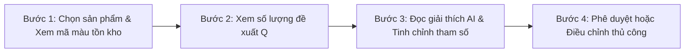

# 🌿 FreshGuard AI — Hệ Thống Hỗ Trợ Ra Quyết Định Nhập Hàng Tươi Sống (DSS)

> **Hệ thống Decision Support System (DSS) ứng dụng mô hình AI Prophet & Quản trị tồn kho động nhằm tối ưu hóa nhập hàng tươi sống tại chuỗi siêu thị Bách Hóa Xanh.**

---

## 📌 1. Giới Thiệu Dự Án

Trong ngành bán lẻ thực phẩm và siêu thị, hàng tươi sống (thịt, cá, hải sản, rau củ, trứng) có đặc tính:
- **Hạn sử dụng cực ngắn** (1 - 3 ngày), dễ hư hỏng, khó lưu trữ dài hạn.
- **Nhu cầu tiêu dùng biến động phức tạp** theo thời tiết (mưa bão), ngày trong tuần (thứ 7, chủ nhật), lịch âm (ngày Rằm, Mùng 1) và các chương trình khuyến mãi.

**FreshGuard AI** giải quyết bài toán cốt lõi: **Cân bằng giữa chi phí thiếu hàng (Understock) và chi phí hủy hàng do tồn dư (Overstock)**, giúp Quản lý cửa hàng ra quyết định nhập hàng hằng ngày nhanh chóng, chính xác và minh bạch.

---

## 🚀 2. Hướng Dẫn Sử Dụng Hệ Thống DSS (User Manual)

### 📋 Quy trình 4 bước ra quyết định nhập hàng hằng ngày:



#### 🔴 **Bước 1: Chọn sản phẩm & Kiểm tra cảnh báo tồn kho**
- Tại **Bảng Tổng Quan Tồn Kho (Cột bên trái)**, danh sách các sản phẩm tươi sống được giám sát liên tục theo hệ thống đèn giao thông:
  - 🔴 **Màu Đỏ (Cần nhập gấp):** Tồn kho thực tế đang dưới điểm đặt hàng lại ($I_{current} < ROP$).
  - 🟡 **Màu Vàng (Cận ngưỡng):** Tồn kho đang tiệm cận ngưỡng $ROP$, cần theo dõi sát sức mua.
  - 🟢 **Màu Xanh (Ổn định):** Tồn kho đang ở mức an toàn ($I_{current} \ge ROP$).

#### 📦 **Bước 2: Xem xét đề xuất số lượng nhập ($Q$)**
- Tại **Khối Đề Xuất Nhập Hàng**, hệ thống tự động tính toán lượng đặt hàng khuyến nghị $Q$ dựa trên công thức quản trị tồn kho:
  $$Q = \max(0, (D \times L) + SS - I_{current})$$
- Quan sát **Thanh đo trực quan hóa mức tồn kho thực tế** bên phải để xem tương quan vị trí giữa mức tồn hiện tại ($I_{current}$), tồn an toàn ($SS$) và điểm đặt hàng lại ($ROP$).

#### 💡 **Bước 3: Đọc giải thích AI (Explainability) & Tinh chỉnh kịch bản**
- Xem hộp **"Giải thích lý do (Explainability)"** để hiểu rõ tại sao AI đề xuất tăng/giảm lượng hàng (do yếu tố thời tiết mưa, ngày Rằm/Mùng 1 Âm lịch, hoặc chiến dịch khuyến mãi cuối tuần).
- *(Tùy chọn mô phỏng)*: Người dùng có thể tùy biến các tham số trong **Bộ điều chỉnh tham số nhu cầu & an toàn**:
  - $D$: Nhu cầu tiêu thụ trung bình mỗi ngày.
  - $\sigma_d$: Độ lệch chuẩn biến động nhu cầu.
  - $L$: Thời gian chờ giao hàng (Lead time).
  - $Z$: Hệ số an toàn (tương ứng mức phục vụ Service Level từ 90% đến 99%).
  - Kéo thanh trượt **Tồn kho thực tế ($I_{current}$)** để xem kết quả tính toán $Q$ biến thiên theo thời gian thực.

#### ✅ **Bước 4: Phê duyệt hoặc Điều chỉnh thủ công**
- **Nút "Phê duyệt" (Màu xanh):** Đồng ý với đề xuất của AI và chuyển tiếp đơn hàng sang hệ thống ERP / Kho tổng.
- **Nút "Điều chỉnh" (Màu trắng):** Khi có thông tin phát sinh thực tế tại cửa hàng (khách đặt sỉ, tủ mát hỏng), bấm "Điều chỉnh", nhập số lượng mong muốn và bấm "Phê duyệt".

---

## 📐 3. Bảng Tra Cứu Công Thức Quản Trị Tồn Kho

| Chỉ số | Tên Tiếng Anh | Ý Nghĩa Quản Trị | Công Thức |
| :--- | :--- | :--- | :--- |
| **$SS$** | Safety Stock | **Tồn kho an toàn**: Lượng hàng đệm chống rủi ro đột biến nhu cầu hoặc giao hàng trễ. | $$SS = Z \times \sigma_d \times \sqrt{L}$$ |
| **$ROP$** | Reorder Point | **Điểm đặt hàng lại**: Ngưỡng tồn kho kích hoạt phát tín hiệu đặt hàng. | $$ROP = (D \times L) + SS$$ |
| **$Q$** | Order Quantity | **Lượng đặt hàng đề xuất**: Khối lượng cần nhập để đạt mức tồn mục tiêu. | $$Q = \max(0, (D \times L) + SS - I_{current})$$ |
| **$Z$** | Safety Factor | **Hệ số an toàn**: Phản ánh tỷ lệ phục vụ khách hàng (Service Level). | $90\% \to Z=1.28$<br>$95\% \to Z=1.65$<br>$98\% \to Z=2.05$<br>$99\% \to Z=2.33$ |

---

## 🏗️ 4. Kiến Trúc Hệ Thống (4 Lớp)

1. **Lớp 1 - Data Layer (Đầu vào):** Thu thập dữ liệu lịch sử bán hàng POS, Lead time, Lịch Âm/Dương, Ngày lễ & Khuyến mãi.
2. **Lớp 2 - AI Layer (Thuật toán):** Mô hình Facebook Prophet phân rã chuỗi thời gian (Xu hướng dài hạn, Mùa vụ tuần/năm, Sự kiện ngày lễ) xuất ra nhu cầu dự báo $D$ và khoảng tin cậy.
3. **Lớp 3 - Decision Layer (Bộ chỉ số quản trị):** Tính toán $SS, ROP, Q$ theo công thức quản trị tồn kho động.
4. **Lớp 4 - Presentation Layer (Giao diện DSS):** Dashboard tương tác với bảng màu cảnh báo, giải thích minh bạch, mô phỏng thời gian thực và phê duyệt một chạm.

---

## 💻 5. Hướng Dẫn Cài Đặt & Chạy Cục Bộ (Local Setup)

### Yêu cầu môi trường:
- **Node.js**: >= 18.0.0 (Khuyến nghị **Node.js 20 LTS**)
- **npm**: >= 9.0.0

### Các bước cài đặt:

```bash
# 1. Clone repository
git clone https://github.com/truongminhnhut-ncrew/FreshGuard-AI.git
cd FreshGuard-AI

# 2. Cài đặt toàn bộ dependencies (Frontend & Backend)
npm run install-all

# 3. Khởi chạy ứng dụng ở chế độ phát triển
npm run dev
```

Hoặc chạy riêng Frontend:
```bash
cd frontend
npm install
npm run dev
```

Truy cập giao diện tại: `http://localhost:5173`

---

## 🌐 6. Triển Khai Lên Netlify

Dự án đã được cấu hình sẵn sàng cho Netlify qua tệp `netlify.toml`:
- **Build Base**: `frontend`
- **Build Command**: `npm run build`
- **Publish Directory**: `dist`
- **Node Version**: `20` (Pin Node.js 20 LTS tránh lỗi build)

---

## 👥 Nhóm Tác Giả & Bản Quyền

- Dự án phục vụ mục đích nghiên cứu, học thuật & thực nghiệm giải pháp hỗ trợ ra quyết định thông minh trong bán lẻ.
- Bản quyền © 2026 **FreshGuard AI Team**.
